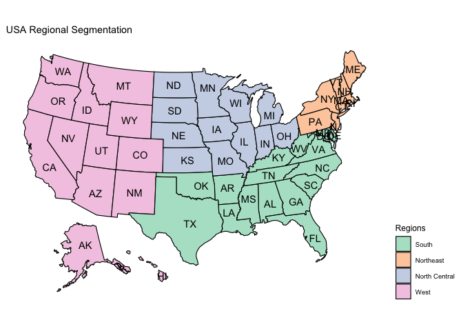
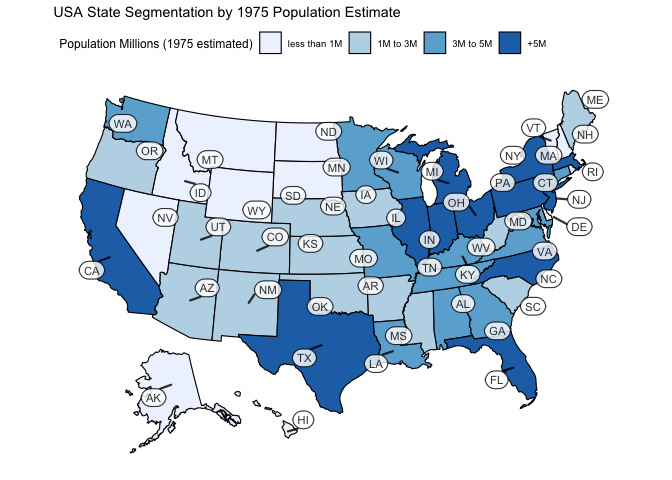

US States Plots
================

### Notebook objective

  - Code to produce US state maps in R with metric segmentation

### Packages

``` r
required_packages <- c('tidyverse', 'usmap', 'ggrepel', 'rgdal')
for(p in required_packages) {
  ## un-comment the below lines to install packages not installed
  # if(!require(p,character.only = TRUE))
  #       install.packages(p, repos = "http://cran.us.r-project.org")
  library(p,character.only = TRUE)
}
```

### Load example dataset

  - data included with base R
  - warning population data values are estimates from 1975

<!-- end list -->

``` r
estimated_state_pop_1975 <- tibble(
      state_full_name = rownames(state.x77),
      # we can divide pop value by "1000" to put the var on millions scale
      state_population_estimated_1975_millions = as.data.frame(state.x77)$Population/1000
)

state_df <- tibble(state = state.abb,
       state_full_name = state.name,
       region = state.region) %>%
       left_join(estimated_state_pop_1975)

state_df <- state_df %>% mutate(region = factor(
      region, levels=c("South", "Northeast", "North Central", "West")
            )
      )
```

### States Plot

  - Note: plot\_usmap() expects a two column dataframe as input (see
    ?plot\_usmap for geo input options)
  - Default labeling is a little messy. Custom labels can be added on
    top of the base usmap
  - Binning continuous variables tends to make values between states
    easier to read

<!-- end list -->

``` r
plot_usmap(data = state_df %>% select(state, region),
           values = "region", labels = T) + 
  scale_fill_brewer(palette = "Pastel2", na.translate=FALSE) +
  theme(legend.position = "right") +
  labs(fill="Regions",
       title="USA Regional Segmentation")
```

<!-- -->

US states plot with more customized legend and labeling

``` r
states_df_2 <- state_df %>% 
      mutate(lon = state.center$x,
             lat = state.center$y,
            population_bins = case_when(
                  state_population_estimated_1975_millions<1 ~ "less than 1M",
                  state_population_estimated_1975_millions<=3 ~ "1M to 3M",
                  state_population_estimated_1975_millions<=5 ~ "3M to 5M",
                   T ~ "+5M"),
             population_bins = factor(population_bins, 
                                      levels=c("less than 1M", "1M to 3M",
                                               "3M to 5M", "+5M"))) %>%
      select(lon, lat, everything())

### ...transform expects lon and late to be in first two columns
### transforms the center values to scale to usmap
states_df_2 <- usmap_transform(states_df_2)

### manually set AK and HI values
states_df_2 <- states_df_2 %>%
      mutate(lon.1 = case_when(
                  state=="AK" ~ -1209511.408,
                  state=="HI" ~ -209671.019,
                  T~lon.1),
             lat.1 = case_when(
                  state=="AK" ~ -1857070.429,
                  state=="HI" ~ -2277070.429,
                  T~lat.1
             ))

plot_usmap(data = states_df_2 %>% select(state, population_bins),
           values = "population_bins") + 
  geom_label_repel(data=states_df_2, 
                   aes(x=lon.1, y=lat.1, label=state),
                   size = 3, alpha = 0.8,
                   label.r = unit(0.5, "lines"), label.size = 0.4,
                   segment.color = "black", segment.size = 0.8, seed = 123) +
  scale_fill_brewer(palette = "Blues", na.translate=FALSE) +
  theme(legend.position = "top") +
  labs(fill="Population Millions (1975 estimated)",
       title="USA State Segmentation by 1975 Population Estimate")
```

<!-- -->

### Takeaways

  - Several R packages exist to make plotting geo data manageable
  - usmap::plot\_usmap() is great for fast metric exploration by state
  - Customizing and cleaning up default visualizations can take some leg
    work
